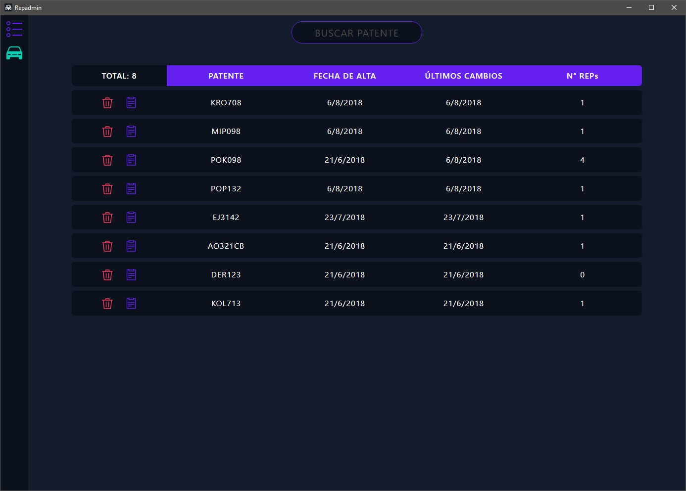
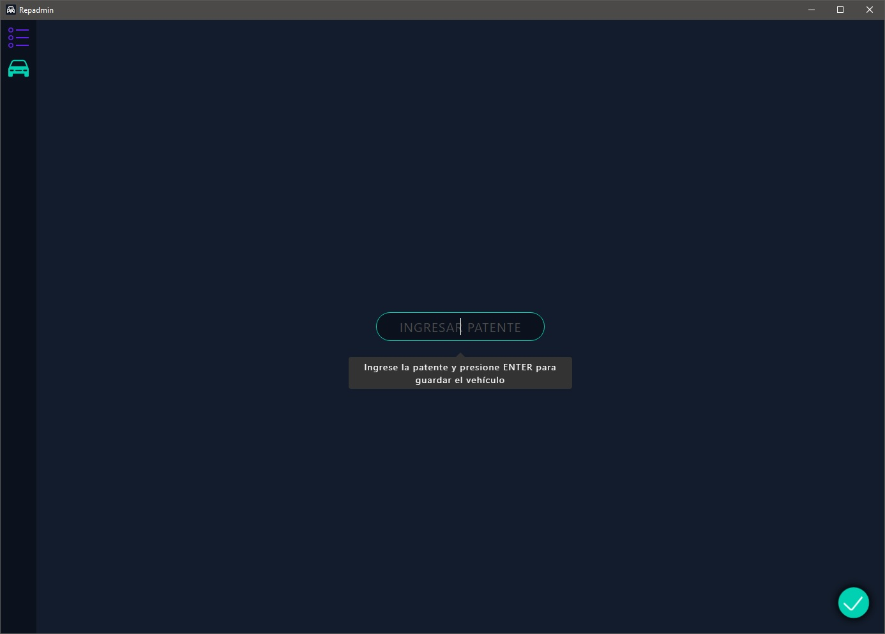
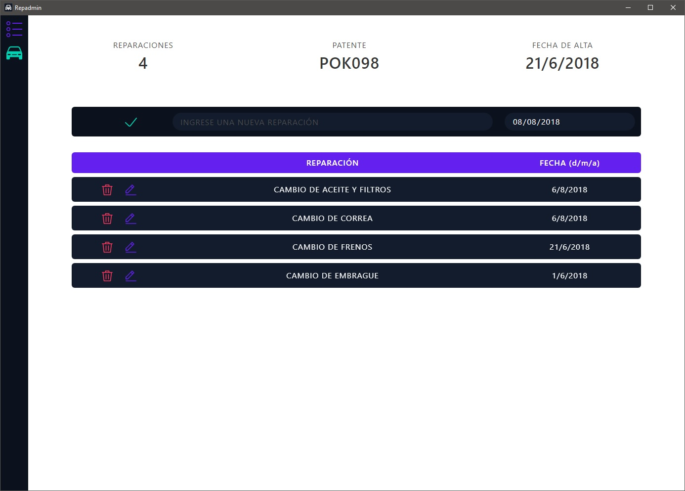

# Repadmin
### Un sistema para gestionar reparaciones de vehículos de manera simple con una base de datos local integrada
___

[__Descargar (64bit)__](https://github.com/frankoespa/repadmin/releases/download/v1.0.0/Repadmin-1.0.0.Setup.exe)

---

#### Listado de vehículos

    </img>

#### Cargar un vehículo

    </img>

#### Administrar un vehículo

    </img>

#### Eliminar un vehículo

    </img>

## Tecnologías
___

- [__React Js__](https://reactjs.org/)
- [__Electron__](https://electronjs.org/)
- [__NeDB__](https://github.com/louischatriot/nedb)

